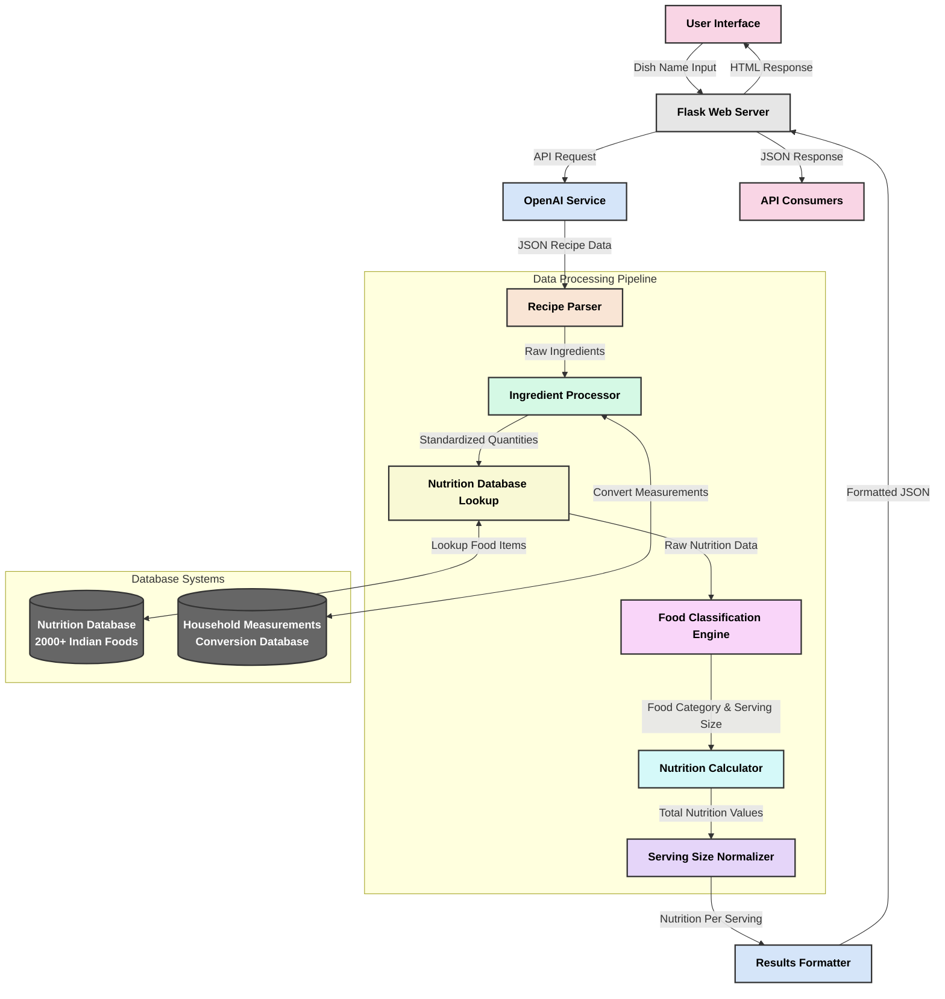

# 🍛 Indian Dish Nutrition Calculator

Welcome to the Indian Dish Nutrition Calculator! This tool helps you calculate the nutritional value of your favorite Indian dishes with just a few clicks.

## 🚀 What It Does

This application takes the name of any Indian dish (like "Paneer Butter Masala" or "Dal Makhani") and provides you with a detailed nutritional breakdown per serving. Perfect for anyone interested in tracking their nutrition while enjoying delicious Indian cuisine!

## ✨ Features

- 🔍 **Dish Search**: Enter any Indian dish name
- 🧪 **AI-Powered Recipe Fetching**: Uses OpenAI to get accurate ingredient lists
- 📊 **Nutritional Analysis**: Calculates calories, protein, carbs, fat, and fiber
- 🍽️ **Standard Serving Sizes**: Results shown per typical serving (katori, plate, piece)
- 📱 **Responsive Design**: Works on mobile and desktop devices
- 🔌 **API Access**: Includes an endpoint for programmatic access

## 🔄 How It Works

## Screenshots

.jpeg)
.jpeg)


## 💡 The Science Behind It

1. **Recipe Fetching**: We use OpenAI's API to get accurate recipe information for Indian dishes
2. **Ingredient Processing**: We convert household measurements (cups, tablespoons) to grams
3. **Nutrition Mapping**: We map ingredients to our comprehensive nutrition database
4. **Food Classification**: We categorize dishes and determine appropriate serving sizes
5. **Calculation**: We calculate total and per-serving nutrition values

## 📊 Example Output

For a dish like **Paneer Butter Masala**:

- 🔥 **Calories**: ~320 kcal per katori
- 🥩 **Protein**: ~12g per katori
- 🍚 **Carbs**: ~15g per katori
- 🧈 **Fat**: ~22g per katori
- 🌾 **Fiber**: ~3g per katori

## 🛠️ Technical Implementation

The project is built with:
- **Backend**: Python with Flask framework
- **Database**: CSV-based nutrition database with 2000+ food items
- **AI Integration**: OpenAI API for recipe fetching
- **Frontend**: HTML, CSS with Bootstrap, and vanilla JavaScript

## 🏃‍♀️ How to Run

1. Clone the repository
2. Install dependencies: `pip install -r requirements.txt`
3. Set up your OpenAI API key as an environment variable
4. Run the application: `python main.py`
5. Access the web interface at `http://localhost:5000`

## 📝 API Usage

Send a POST request to `/api/calculate` endpoint:

```json
{
  "dish_name": "Paneer Butter Masala"
}
